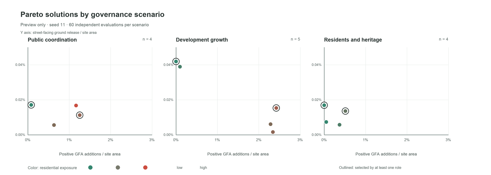

# 从利益相关者权力到城市形态：上海打浦桥城市更新的多目标生成与事后偏好框架

## 1. 摘要

历史街区更新同时涉及遗产保护、居住延续与开发利用。本文以上海打浦桥为例，提出将治理规则置于形态生成之前、将主体偏好置于 Pareto 搜索之后的多目标框架。公共协调、开发增长、居民与遗产优先三个情景分别限定可改动对象和形态操作，共用居住影响暴露、正向增建量和临街释放地面潜力三个目标；居民、开发实施和公共规划视角以离散优先级选择方案。单种子预览中，三个情景各完成 60 次有效独立评价，保留 4、5、4 个 ε-Pareto 解。开发增长情景出现最高正向增建量和临街释放地面极值，而角色首选解揭示正向增建与街区净建筑面积变化并不等同。这些观察用于检验框架和提出待比较的形态差异；传统参数基线与三情景的多种子正式对照仍待完成。

**关键词：** 存量城市更新；遗产保护；多目标优化；利益相关者；打浦桥

## 2. 引言

历史街区更新需要同时处理建筑保护、居住改善和开发利用。增加开发容量可能涉及既有住宅的改动，释放地面空间也可能影响原有经营和日常生活。因此，更新方案的评价既涉及空间性能，也涉及收益与代价在不同主体之间的分配。在田子坊，基于实地调查的研究已将空间演变与政府、商户等行动者的权力关系联系起来，说明形态变化与空间使用和改造的权限密切相关（Wang & Zhou, 2022）。

计算设计为比较更新方案提供了工具。SIMForms 将形态生成、指标评价和可视化结合起来，场地适应布局研究则将场地条件与用户配置纳入生成规则（Zhang et al., 2024；Wang et al., 2024）。多目标优化进一步通过 Pareto 解集保留不同目标之间的折中方案，无须预先将所有目标合并为一个得分（Deb et al., 2002）。但指标上的折中不能直接回答哪些建筑可以被改动，也不能决定哪些保护要求应优先于性能收益。这些条件需要在生成之前明确。

参与式遗产规划通过共同设计和共同决策，将方案修改与选择交给参与者（Leong & Janssen, 2022）。Kaim 等（2020）则在土地利用优化中引入事后偏好，使利益相关者能够在了解目标取舍后选择方案。这些研究为连接生成与决策提供了基础，也引出本文关注的问题：如何在同一流程中，将生成前的操作权限和保护约束，与生成后的方案偏好分别表达，并追踪它们对应的空间变化。前者决定方案能否出现，后者影响参与者如何选择，两者需要在模型中区分。

上海打浦桥为研究这一问题提供了具有遗产保护背景的场地。区内田子坊保留了石库门里弄和旧厂房，并承载居住、文创商业和旅游等活动。《黄浦区田子坊地区综合管理办法》将特色建筑保护、旧厂房活化、社区微更新和商居协调纳入地区管理要求（黄浦区人民政府，2023）。在这样的街区中，更新既要维持历史空间特征，也要回应现有使用者的需求。遗产保护因而不仅影响建筑形态，还关系到哪些改变可以发生、日常生活如何延续。

本文将公共协调、开发增长、居民与遗产优先三种治理假设编码为操作权限，在共同目标下分别搜索，再以角色优先级作事后选择。预定正式对照另设不读取主体权限的传统参数基线。框架保留规则、评价与逐栋形态变化的记录，以支持后续参与式复核；情景和角色优先级目前均为研究假设。

## 3. 研究对象

### 3.1 打浦桥及其遗产保护背景

研究以上海打浦桥既有街区为对象，重点关注田子坊及周边历史空间与当代使用需求之间的关系。田子坊的里弄住宅、石库门建筑和旧厂房既构成街区的历史特征，也是居住、经营和文化活动的载体。地方管理办法将特色建筑保护与旧厂房活化利用并列提出，同时要求改善社区设施、保障房屋使用安全和协调商居关系（黄浦区人民政府，2023）。

这一背景使场地适合检验治理规则对形态生成的影响。同一种增建或地面释放操作，作用于住宅、商铺或保护对象时，所受限制和涉及的利益并不相同。本研究据此区分可改动对象与保护对象，并通过不同情景设置允许的操作范围。模型中的主体标签用于表达这些研究设定，不能直接视为现实产权或法定决策权。

### 3.2 数据与更新单元

当前数据版本包含 1,370 栋建筑、260 条街网要素、89 个公共服务对象和 38 个道路围合更新单元。其中，1,338 栋建筑关联到更新单元，另有 32 栋因空间匹配不稳定而保持现状。面积和距离均在投影坐标下计算，建筑与更新单元通过稳定标识关联。

保护数据依据黄浦区官方记录进行建筑级匹配。目前有 12 条记录对应到 21 个建筑轮廓，这些轮廓在模型中保持不变；另有 4 条记录因历史范围或现状对应不明确，暂未纳入优化约束，并保留供后续核验。上述匹配属于研究处理，尚不能替代完整的法定保护范围核验。

每个更新单元对应一组研究控制参数。更新单元由道路围合生成，不等同于法定地块。公共空间候选与非穷尽的弄堂入口资料仅作背景，不进入目标或约束；其中公共空间候选一处已核实为公园，另一处仍未核实。实验使用冻结输入，并保存文件校验信息。

> **图 1 待插入：** 场地、38 个更新单元、21 个冻结遗产建筑轮廓及街道网络。建议使用同一坐标系、比例尺和来源说明；不要把背景公共空间候选画成已核实的优化输入。

## 4. 方法

### 4.1 总体流程

研究分为规则设定、方案生成和事后评价三个阶段。首先，根据治理情景确定哪些建筑可以改变、允许哪些操作以及必须满足的条件。其次，生成候选方案，排除违反硬约束的方案，并在三个共同目标下筛选 Pareto 解集。最后，使用角色偏好比较各情景中的备选方案，结合建筑变化记录解释其空间后果。

各情景分别搜索和筛选方案，再在统一指标下比较。这样既保留各自的治理前提，也能观察规则变化对方案范围的影响。

### 4.2 治理情景与形态操作

研究设置三个治理情景。它们使用相同的输入和目标，但分别限定主体、操作许可、强度及最大改动范围（表 1）。旧版四情景已归档，不进入当前平台或本文的主比较。

| 情景 | 可行动作的侧重 | 受限对象 |
|---|---|---|
| 公共协调 | 开发主体有限增建、释放地面与高度退让；公共资产浅退界；居民院落通行改善 | 遗产与未知主体冻结 |
| 开发增长 | 开发主体增建、释放地面及大体量拆分；居民仅可低强度改善通行 | 遗产与未知主体冻结 |
| 居民与遗产优先 | 开发主体释放地面或转移高度；公共资产与居民住宅仅作低强度改善 | 遗产与未知主体冻结，住宅禁止强形态操作 |

**表 1.** 当前三情景的操作侧重；具体阈值与对象清单由配置文件保存，名称不代表现实主体已作出授权。

形态语法包括合规增建（`densify`）、释放临街地面（`open_ground`）、大体量拆分（`split_to_towers`）、敏感对象附近的高度退让（`heritage_step_down`），以及公共资产浅退界（`public_space_reconfiguration`）和居民院落窄通道（`courtyard_access_improvement`）。后两者不增加高度，仅表示候选干预。每次操作记录建筑、更新单元、操作类型、强度及前后属性。

### 4.3 硬约束

候选方案接受九类检查：几何有效性、研究边界、保护对象不变、限高、分区容积率、覆盖率、住宅保留、新增重叠和最大改动范围。前八类构成共同检查；改动范围及情景操作权限是被比较的治理规则。算子可先按余量截断或缩放，统一检查后仍违反阻断性约束的候选被淘汰，不回退为伪可行解。

### 4.4 评价目标

所有方案采用三个共同指标，分别衡量居住影响暴露、正向增建量和临街释放地面潜力。

居住影响暴露计入直接发生形态变化的住宅，以及与增高、拆分或退台建筑处于同一更新单元的住宅，取值越低越好：

\[
f_1 = \frac{\sum_{i \in R,\,i\ exposed} GFA_i^{base}}{\sum_{i \in R} GFA_i^{base}}
\]

其中，\(R\) 为住宅建筑集合，\(exposed\) 为上述离散暴露判定。该指标不使用距离权重，也不等同于住户搬迁或生活质量测量。

正向增建量将逐栋正建筑面积增量相加后除以研究区面积，取值越高越好：

\[
f_2 = \frac{\sum_i \max(0, GFA_i^{proposal}-GFA_i^{base})}{A_{site}}
\]

其中，\(GFA_i^{proposal}\) 为方案建筑面积，\(A_{site}\) 为研究区面积。该指标不扣减其他建筑的减量，因此必须与净 GFA 变化并列阅读。

临街地面释放潜力以原有建筑占地中被释放、且位于道路 5 米缓冲区内的面积占研究区面积的比例表示，取值越高越好：

\[
f_3 = \frac{Area[(Footprint_{base}-Footprint_{proposal}) \cap StreetBuffer_{5m}]}{A_{site}}
\]

其中，\(Footprint\) 表示建筑占地范围，\(StreetBuffer_{5m}\) 表示道路 5 米缓冲区。公共空间候选和弄堂入口不参与计算；该值既不是已形成的公共空间面积，也不表征产权或可达性。三目标的 ε 分辨率依次为 0.001、0.0005 和 0.00005；低于 1 m² GFA、1 m² 足迹且 0.1 m 高度的单体变化作为数值噪声处理。

### 4.5 多目标搜索与事后偏好

治理情景使用 NSGA-II 搜索，先保存完整精确非支配前沿，再按共同 ε 去除不可辨识差异，另选代表解用于空间阅读（Deb et al., 2002）。现状方案是共同参照，不占有效独立评价预算；重复形态和缓存命中也不计入预算。

每个情景获得 ε-Pareto 解集后，居民、开发实施和公共规划三个视角分别按目标优先级逐级比较；差异落在 ε 内时视为同档，再比较下一目标。角色不使用精确数值权重，也不回写优化过程。另以最差角色名次最小化选取折中解。该设计借鉴事后偏好比较（Kaim et al., 2020），但优先级仍待参与者校准。

> **图 2 待插入：** 冻结数据 → 情景操作权限 → 形态生成与约束检查 → 三目标 Pareto 筛选 → 角色事后排序 → 三维与逐栋变化记录。用单线流程图即可，不加入尚未实现的角色反馈循环。

### 4.6 实验设计

正式主实验计划比较一个传统参数基线与三个治理情景。四组共用冻结输入、三个目标、随机种子和有效独立评价预算；共同控制为 36 m 限高、FAR 3.0、覆盖率 0.60 和住宅 GFA 保留率 0.80。基线仅使用高度倍率 1.00–1.30 与足迹保留率 0.75–1.00，不读取主体权限；情景特定的对象许可、操作强度和更严格阈值构成被比较的治理条件。

计划使用种群 20、20 个计划代数、五个种子（11、23、37、53、71），每组每种子 400 次有效独立评价，共 20 次运行。将报告可行率、完整与 ε-Pareto 数量、统一归一化的超体积、spacing、三目标分布、双向支配覆盖及代表解的逐栋变化；对同种子配对的超体积差异采用双侧 Wilcoxon 检验，并对三个情景的比较作 Holm 校正。五个种子的检验效力有限，效应方向和原始值应与 p 值一并报告。

本文目前可核对的当前模型结果是三情景各一个种子（11）、每次 60 次有效独立评价的预览运行，种群 10。修订前五方法 × 五种子 × 400 次的已归档实验使用不同情景和角色模型，不能充作当前三情景的正式对照。

## 5. 结果

### 5.1 单种子预览的可行性与目标范围

当前三情景均完成 seed 11 的 60 次有效独立评价，分别得到 56、59、50 个可行候选和 4、5、4 个 ε-Pareto 解（表 2）。开发增长情景在此次预览中达到最高正向增建量 0.02420 和最高临街释放地面比例 0.000419；居民与遗产优先情景的正向增建量上界为 0.00511。各值是同一小预算下的观测值，不构成跨种子稳定性或方法优劣证据。

| 情景 | 可行候选 / 60 | ε-Pareto 解数 | 最大正向增建量 | 最大临街释放地面 | 超体积 |
|---|---:|---:|---:|---:|---:|
| 公共协调 | 56 | 4 | 0.01253 | 0.000171 | 0.0798 |
| 开发增长 | 59 | 5 | 0.02420 | 0.000419 | 0.1502 |
| 居民与遗产优先 | 50 | 4 | 0.00511 | 0.000169 | 0.0453 |

**表 2.** 当前模型单种子预览（seed 11，60 次有效独立评价/情景）。两个空间指标均为研究区面积比；超体积采用套件保存的共同归一化边界，仅作本次运行的描述值。来源：`scenario_suites/20260928_223655/suite_summary.csv` 与各情景 `pareto_solutions.csv`。

**图 3.** 三情景共用坐标轴的预览解分布。每个点可在三维平台中对应到代表方案；图中不包含传统参数基线，也不代表正式多种子结果。

### 5.2 角色选择揭示的取舍

在本次预览中，居民与公共规划视角在三个情景内各自选中了同一个解，而开发实施视角选择了另一解。这一一致性只描述当前 Pareto 集及设定的离散优先级，不能解释为真实主体达成共识。例如，开发增长情景中居民和公共规划首选解 `N_00052` 的居住暴露为 0、释放地面比例为 0.000419、正向增建量为 0；开发实施首选解 `N_00053` 的相应值为 0.0913、0.000153 和 0.02420。选择差异可以在共同指标和三维形态之间追踪。

正向增建量不等于净增长。公共协调情景的居民首选解 `N_00053` 虽有 0.000808 的正向增建量，净 GFA 却减少约 25,843 m²；开发实施首选解 `N_00039` 的正向增建量为 0.01253，净 GFA 仅增加约 208 m²。前者说明部分建筑增建可以与更大规模的减量并存，后者说明正向指标可能掩盖几乎相抵的减量。因此，代表解应同时展示正向与净变化。

> **图 4 待插入：** 同一情景内居民与开发实施首选解的并列三维形态、改动建筑位置和逐栋增减量。优先采用公共协调的 `N_00053` 与 `N_00039`，统一相机、比例尺和底图；图注分别报告正向增建与净 GFA。

### 5.3 正式对照尚待完成

当前结果尚无传统参数基线的同预算、同种子正式运行，不能检验三情景相对于基线的覆盖损失，也不能报告配对显著性或稳健性结论。归档的五方法高预算图对应修订前模型，故不插入本节。完成四组 × 五种子 × 400 次评价后，表 2 应由逐种子均值、离散程度与原始值替换，图 3 应由正式前沿和双向支配覆盖图替换。

> **图 5 待插入：** 正式四组对照的各种子 Pareto 前沿、超体积与双向支配覆盖。仅在当前三情景正式矩阵完成、通过预算公平性审计后生成。

## 6. 讨论

### 6.1 生成权限与事后偏好分处两个阶段

情景规则决定哪些建筑及动作能进入候选集；角色优先级只从已经生成的 Pareto 集中选解。这使形态差异可以分别追溯到操作许可和事后选择。预览中角色首选解的分化说明界面能够呈现取舍，但尚不足以证明某情景更适合现实治理。尤其是开发增长情景在小预算下取得较高空间指标上界，不能脱离其较宽的行动权限解释为整体规划优势。

### 6.2 指标的解释边界

居住影响暴露是更新单元层面的离散代理量，不测量搬迁、噪声或生活质量。临街释放地面只测算足迹变化与道路缓冲的交集，不证明地面实际开放。正向增建与净 GFA 的背离进一步表明，单一目标极值不足以评价街区总量后果。正式结果应并列报告净量、改动建筑及其主体分类，并结合统一视角的形态图阅读。

### 6.3 数据和实验限制

道路围合更新单元及控制阈值为研究设定，不能替代法定控规。21 个遗产轮廓来自 12 条已匹配记录，另 4 条历史范围未决；32 栋未匹配更新单元的建筑被单独冻结。角色优先级未经过参与者验证。当前仅有一个 seed 和 60 次评价，超体积及前沿规模受随机性与预算影响；正式实验还需检验 ε 和情景阈值敏感性、算法对照，以及参与者能否理解并修订这些规则。

## 7. 结论

本文建立了“治理规则约束生成—共同目标筛选—角色事后选择—逐栋形态追溯”的打浦桥更新框架。当前三情景单种子预览表明，该流程能够生成并比较可审计的空间取舍，且正向增建与净 GFA 可能明显分离。本文尚不能依据预览判断哪种情景在现实中更优。下一步将完成传统参数基线与三情景的多种子同预算对照，再以法定资料和参与者反馈校准保护范围、操作许可与角色优先级。

## 参考文献

- Deb, K., Pratap, A., Agarwal, S., & Meyarivan, T. (2002). A fast and elitist multiobjective genetic algorithm: NSGA-II. *IEEE Transactions on Evolutionary Computation*, 6(2), 182–197. <https://doi.org/10.1109/4235.996017>
- Kaim, A., Strauch, M., & Volk, M. (2020). Using Stakeholder Preferences to Identify Optimal Land Use Configurations. *Frontiers in Water*, 2, 579087. <https://doi.org/10.3389/frwa.2020.579087>
- Leong, S. L., & Janssen, P. (2022). *Participatory Planning: Heritage Conservation through Co-design and Co-decision*. Proceedings of CAADRIA 2022, Vol. 2, 505–514. <https://doi.org/10.52842/conf.caadria.2022.2.505>
- Wang, M., & Zhou, Y. (2022). The production and evolution of urban cultural and creative tourism destination from the perspective of power space: A case study of Tianzifang, Shanghai. *Geographical Research*, 41(2), 373–389. <https://doi.org/10.11821/dlyj020201265>
- Wang, Y., Hu, Q., Tang, P., Fang, R., & Meng, Y. (2024). *Urban Site Adaptive Layout Generation: User-configurable Algorithms Based on MQP*. Proceedings of CAADRIA 2024, Vol. 2, 505–514. <https://doi.org/10.52842/conf.caadria.2024.2.505>
- Zhang, B., Mo, Y., Li, B., Wang, Y., Zhang, C., & Shi, J. (2024). *SIMForms: A Web-Based Generative Application Fusing Forms, Metrics, and Visuals for Early-Stage Design*. Proceedings of CAADRIA 2024, Vol. 1, 373–382. <https://doi.org/10.52842/conf.caadria.2024.1.373>
- 黄浦区人民政府（2023）。《黄浦区田子坊地区综合管理办法》，黄府规〔2023〕3 号，2023 年 3 月 12 日施行。<https://service.shanghai.gov.cn/XingZhengWenDangKuJyh/XZGFDetails.aspx?docid=230220141250SGUTAJDzyGiwTLVshtA>
